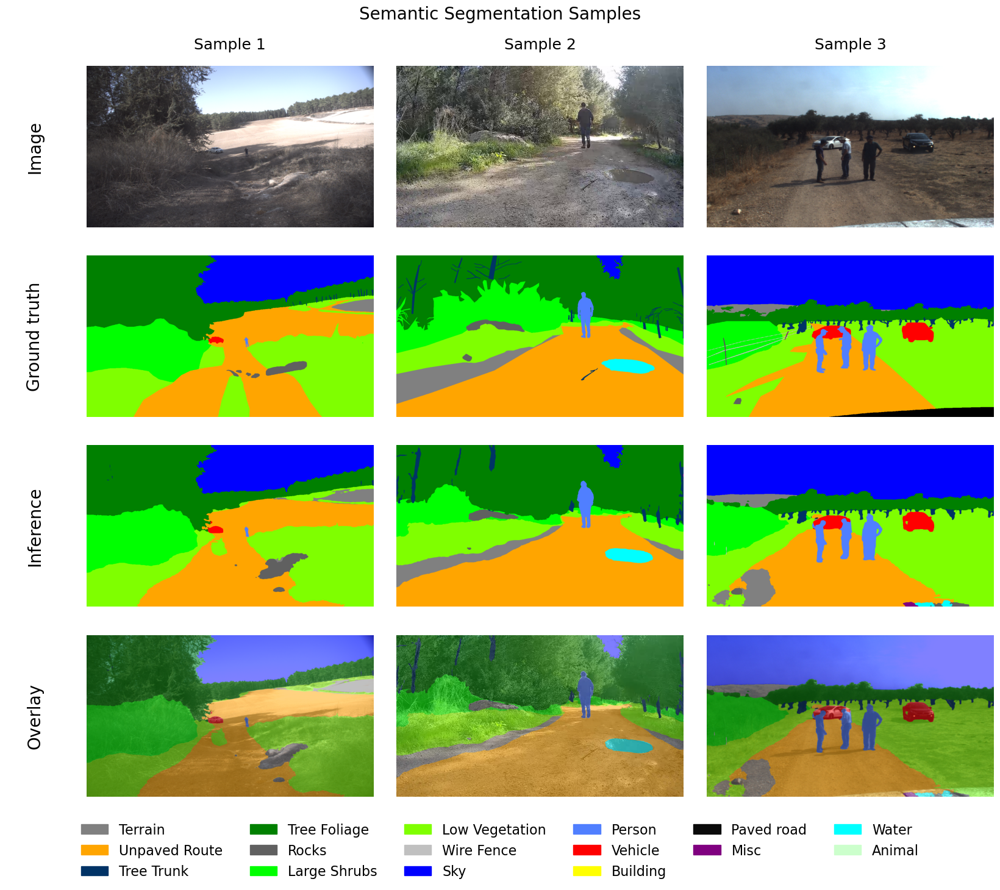
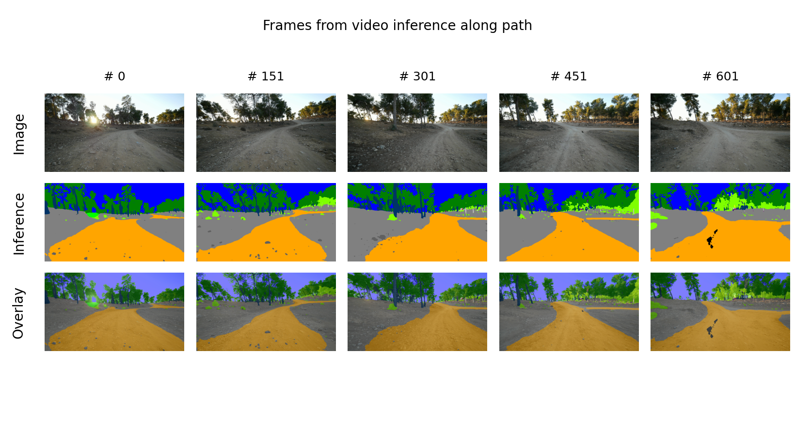
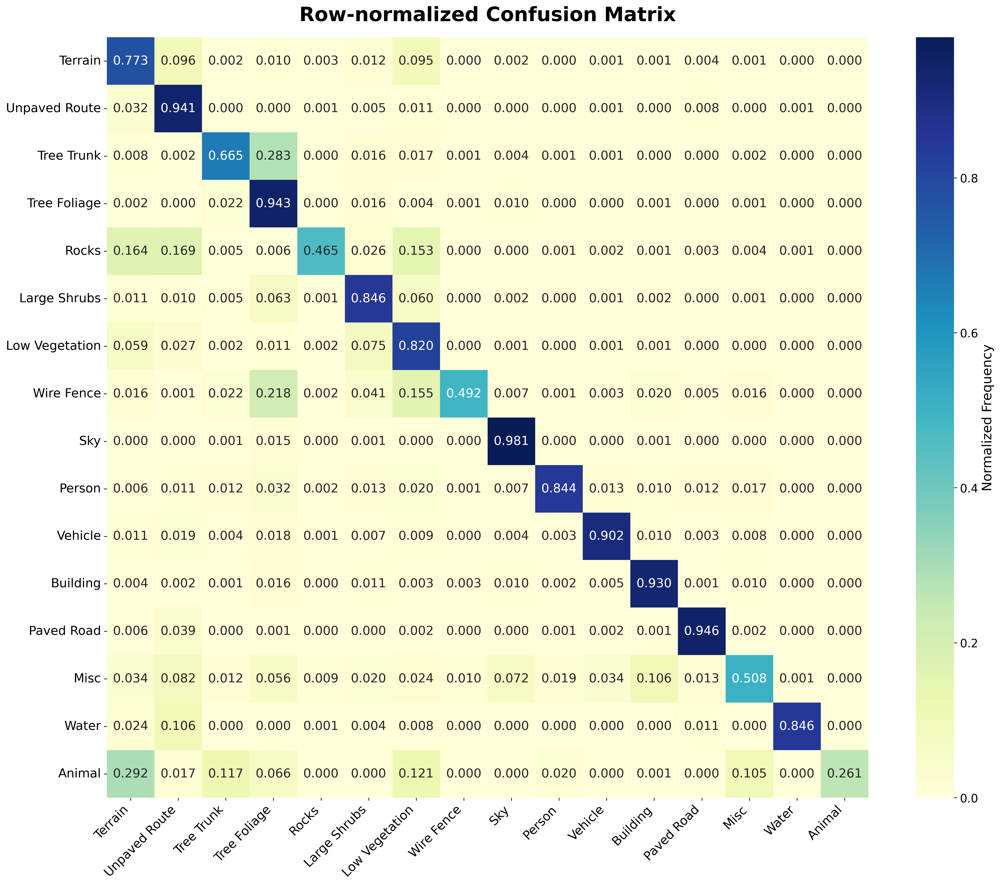
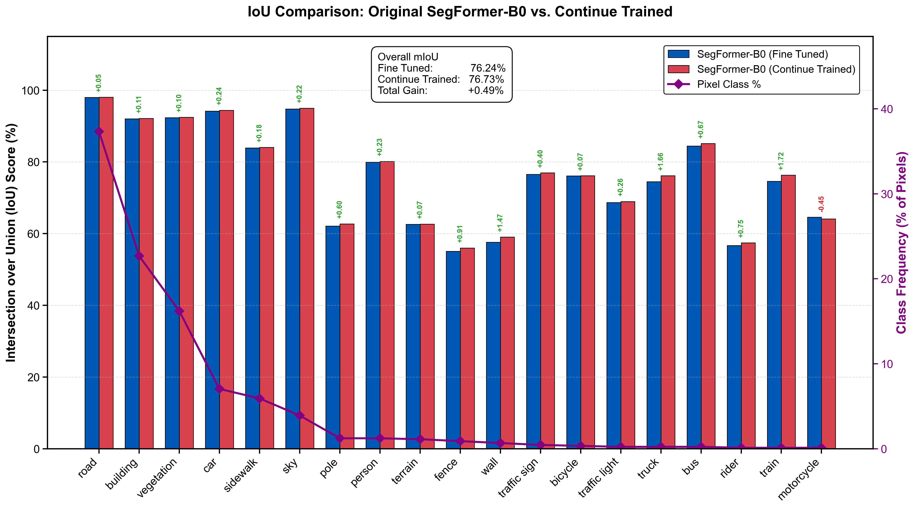
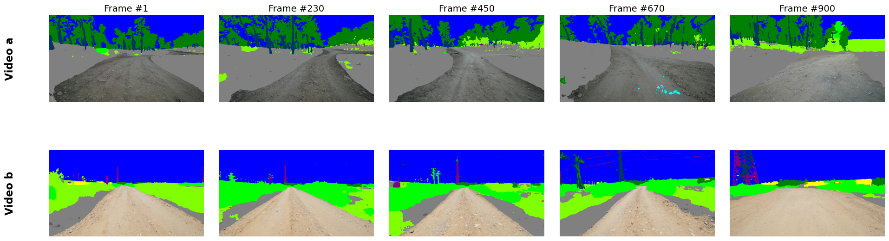

# Off-Road Autonomous Vehicles: Semantic Segmentation and Spatial Overlay Video Assembly

This repository presents an integrated framework for **off-road autonomous navigation** that jointly improves **semantic segmentation robustness** and **task-aware video compression**. The method combines a confusion-aware composite loss (**CCAL**) for segmentation training with a **spatial overlay video representation** that preserves RGB detail only in safety-critical regions while abstracting less important background areas into semantic color blocks.

## Main Contributions

- A large-scale off-road dataset with **14,879** high-resolution images.
- Pixel-wise annotations over **16 semantic classes** .
- A **Confusion-Aware Composite Loss (CCAL)** that improves class separability by penalizing systematic inter-class confusion.
- A **segmentation-driven spatial overlay representation** for bandwidth-efficient video transmission in teleoperation and autonomous navigation.

## Dataset Preview

### Qualitative Segmentation Examples

### Class Co-Occurrence Matrix

## Method Overview

### Normalized Confusion Matrix Used by CCAL

### Spatial Overlay Video Assembly Pipeline

The spatial overlay pipeline starts from an RGB input frame and its semantic prediction. Instead of transmitting the full natural image, the system preserves high-fidelity RGB content in **mission-critical regions of interest (ROI)** such as the navigable path and near obstacles, while replacing less important regions such as sky and distant vegetation with semantic color blocks. This representation reduces bandwidth while maintaining the visual information required for safe remote driving.

## Segmentation Results

### Off-Road Per-Class IoU Comparison

The proposed **CCAL** improves off-road segmentation performance from **68.66%** to **70.06% mIoU**.

### Cross-Domain Evaluation on Cityscapes (SegFormer-B0)

CCAL also improves cross-domain generalization on Cityscapes, increasing performance from **76.24%** to **76.73% mIoU** for **SegFormer-B0**.

### Comparison with Common Loss Functions (Cityscapes, SegFormer-B0)

| Loss Function | Best Loss mIoU (%) | Mean | Std | Best Improvement (%) |
| --- | ---: | ---: | ---: | ---: |
| **CCAL** | **76.73** | 76.49 | 0.026 | **0.49** |
| Focal | 76.64 | 76.37 | 0.061 | 0.40 |
| balanced CE | 76.48 | 76.27 | 0.310 | 0.24 |
| Dice | 76.05 | 75.71 | 0.033 | -0.19 |
| Tversky | 75.48 | 75.18 | 0.108 | -0.76 |

### Relative Performance Across SegFormer Variants

| Model Variant | Baseline mIoU (%) | CCAL mIoU (%) | Improvement (%) |
| --- | ---: | ---: | ---: |
| SegFormer-B0 | 76.24 | 76.73 | 0.49 |
| SegFormer-B1 | 78.55 | 78.71 | 0.16 |
| SegFormer-B2 | 80.83 | 81.11 | 0.28 |
| SegFormer-B3 | 81.53 | 81.96 | 0.43 |
| SegFormer-B4 | 82.33 | 82.66 | 0.33 |
| SegFormer-B5 | 82.26 | 82.60 | 0.34 |

## Spatial Overlay Video Results

### Representative Spatial Overlay Frames

### Lossless Bandwidth Requirements

| Configuration (1920 × 1080) | Video A (Mbps) | Video B (Mbps) |
| --- | ---: | ---: |
| Original YUV420p baseline | 746 | 746 |
| Lossless FFV1 (Standard) | 280 | 396 |
| Purely Semantic (FFV1) | 14.5 | 24.0 |
| Spatially Composite (Overlay), FFV1 | 117 | 151 |

The spatial overlay representation reduces lossless bandwidth requirements by approximately **84%** for Video A and **80%** for Video B relative to the raw YUV420p baseline, while the purely semantic representation achieves reductions above **96%**.

### Lossy Compression Quality Across Codecs

| Bandwidth (Mbps) | Codec | Standard PSNR (dB) | Standard VMAF | Semantic PSNR | Semantic VMAF | Spatial Overlay PSNR | Spatial Overlay VMAF |
| ---: | --- | ---: | ---: | ---: | ---: | ---: | ---: |
| 1 | H.264 | 32.0 | 25.0 | 33.4 | 38.1 | 32.1 | 26.1 |
| 2 | H.264 | 33.8 | 44.0 | 41.1 | 89.1 | 35.5 | 66.8 |
| 4 | H.264 | 35.7 | 64.0 | 43.6 | 94.8 | 38.7 | 79.3 |
| 1 | H.265 | 26.1 | 25.6 | 30.3 | 68.7 | 33.5 | 51.8 |
| 2 | H.265 | 27.1 | 39.2 | 32.8 | 83.3 | 36.0 | 70.8 |
| 4 | H.265 | 28.4 | 54.5 | 35.9 | 91.5 | 38.9 | 86.2 |
| 1 | AV1 | 31.2 | 42.8 | 35.7 | 71.7 | 33.2 | 54.2 |
| 2 | AV1 | 32.5 | 56.5 | 38.0 | 83.1 | 35.3 | 71.4 |
| 4 | AV1 | 34.2 | 70.7 | 41.7 | 93.3 | 37.7 | 85.2 |

At medium bitrate settings, the spatial overlay mode consistently offers a strong trade-off between perceptual quality and compression efficiency. For example, at **2 Mbps with H.264**, the spatial overlay representation improves **VMAF** from **44.0** to **66.8** compared with standard video encoding.

### AV1 ROI / Background PSNR Breakdown

| Bandwidth (Mbps) | Encoding Scheme | Overall PSNR | ROI PSNR | Background PSNR |
| ---: | --- | ---: | ---: | ---: |
| 1 | Standard | 31.2 | 31.7 | 30.9 |
| 1 | Semantic | 35.7 | 40.2 | 34.5 |
| 1 | Spatial Overlay | 33.2 | 31.8 | 34.0 |
| 2 | Standard | 32.5 | 32.9 | 32.3 |
| 2 | Semantic | 38.0 | 42.2 | 36.8 |
| 2 | Spatial Overlay | 35.3 | 33.5 | 36.4 |
| 4 | Standard | 34.2 | 34.5 | 34.1 |
| 4 | Semantic | 41.7 | 45.5 | 40.6 |
| 4 | Spatial Overlay | 37.7 | 35.6 | 39.0 |

These results show that the spatial overlay representation preserves **ROI quality** while substantially improving background reconstruction efficiency under tight bitrate constraints.

## Practical Impact

- **No added inference overhead from CCAL**: the loss is used only during training.
- **Lower transmission load** for teleoperation in bandwidth-constrained off-road networks.
- **Improved path-planning reliability** through better distinction between navigable terrain and nearby obstacles.

## Limitations

- The dataset remains inherently imbalanced, reflecting real-world off-road conditions.
- Geographic coverage is broader than many prior datasets, but still limited relative to global terrain diversity.
- Severe weather, low light, fog, dust, and sensor degradation may still reduce segmentation and transmission robustness.
- Conventional codecs are not optimized for hybrid semantic-natural video streams, leaving room for dedicated codec design.

## Pretrained Weights

### Semantic Segmentation Weights
# best Different loss on segformer-b0
- [Download Link 1](https://drive.google.com/drive/folders/1M008pGgZE8FAIPNRmpMDQ2gwy2UpSIyp?usp=drive_link)
# segformer-b0-5-finetuned-cityscapes
- [Download Link 2](https://drive.google.com/file/d/1n67Kalw_Pzl5qppzioKAAOxhngfMiq4E/view?usp=drive_link)

### Notes
Download the checkpoint and place it in the `weights/` directory before running evaluation or inference.
## Citation

If you use this work, please cite the corresponding paper.
